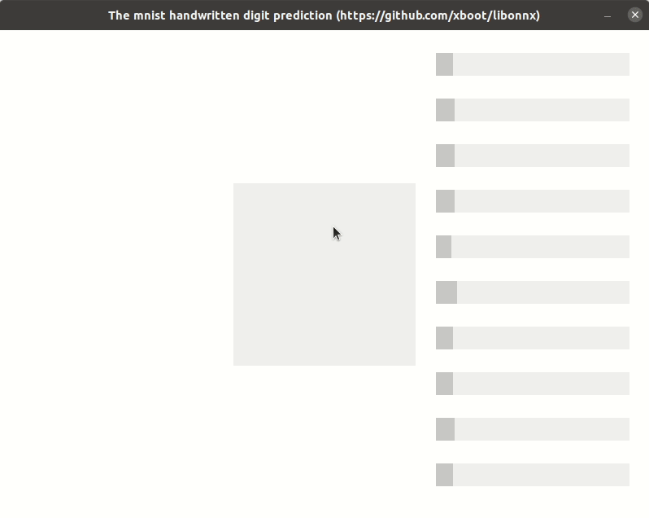

***
# Libonnx
A lightweight, portable pure `C99` `onnx` `inference engine` for embedded devices with hardware acceleration support.

## Getting Started
The library's .c and .h files can be dropped into a project and compiled along with it. Before use, should be allocated `struct onnx_context_t *` and you can pass an array of `struct resolver_t *` for hardware acceleration.

The filename is path to the format of `onnx` model.

```c
struct onnx_context_t * ctx = onnx_context_alloc_from_file(filename, NULL, 0);
```

Then, you can get input and output tensor using `onnx_tensor_search` function.

```c
struct onnx_tensor_t * input = onnx_tensor_search(ctx, "input-tensor-name");
struct onnx_tensor_t * output = onnx_tensor_search(ctx, "output-tensor-name");
```

When the input tensor has been setting, you can run inference engine using `onnx_run` function and the result will putting into the output tensor.

```c
onnx_run(ctx);
```

Finally, you must free `struct onnx_context_t *` using `onnx_context_free` function.

```c
onnx_context_free(ctx);
```

## Examples

Just type `make` at the root directory, you will see a static library and some binary of [examples](examples) and [tests](tests) for usage.

```shell
cd libonnx
make
```

## Screenshots
* [Mnist handwritten digit prediction](examples/mnist)


## Notes

This library based on the onnx version [1.9.1](https://github.com/onnx/onnx/tree/rel-1.9.1) with the newest `opset 14` support. [The supported operator table](documents/the-supported-operator-table.md) in the [documents](documents) directory.

## Links

* [The chinese discussion posts](https://whycan.com/t_5440.html)
* [The onnx operators documentation](https://github.com/onnx/onnx/blob/master/docs/Operators.md)
* [The tutorials for creating ONNX models](https://github.com/onnx/tutorials)
* [The pre-trained onnx models](https://github.com/onnx/models)

## License

This library is free software; you can redistribute it and or modify it under the terms of the MIT license. See [MIT License](LICENSE) for details.

